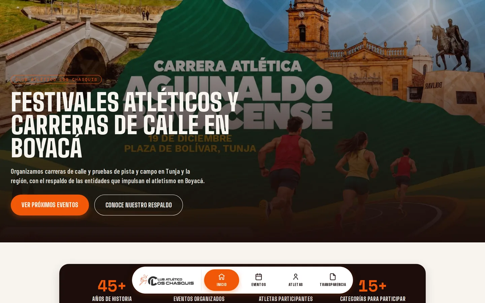
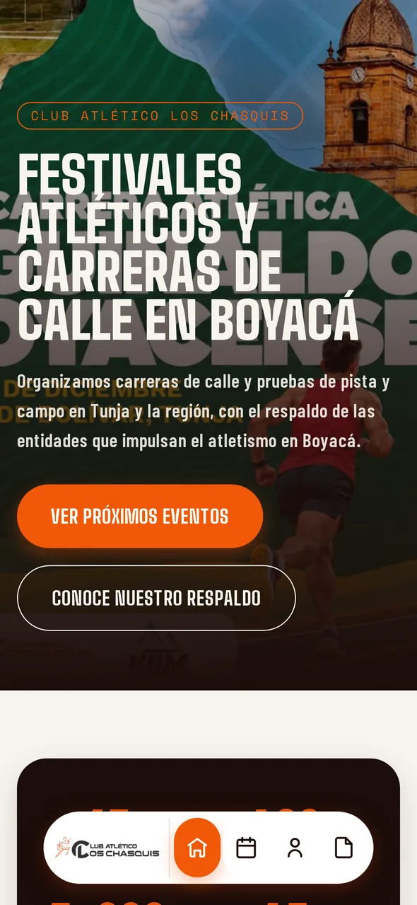
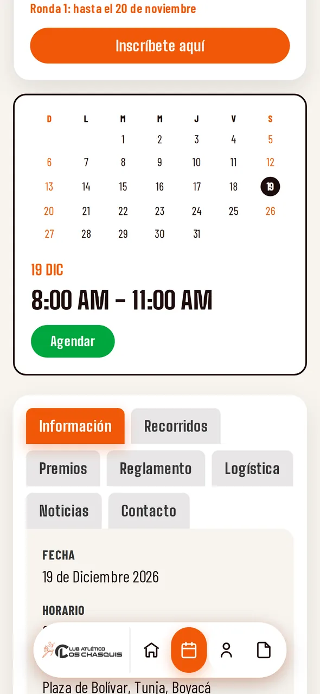
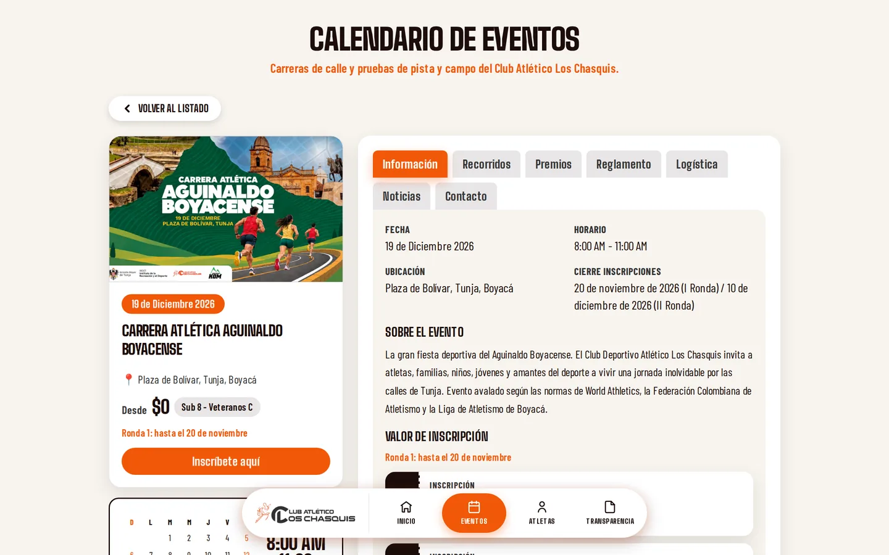

# Club Deportivo Atlético Los Chasquis — Plataforma web

Plataforma web del **Club Deportivo Atlético Los Chasquis** (Tunja, Boyacá,
Colombia), que reemplaza el sitio en WordPress del club. Centraliza el
calendario de carreras de calle y festivales de pista y campo, las
inscripciones con pago en línea y la administración de los eventos, sin que
el club tenga que tocar código.



<p align="center">
  
  &nbsp;&nbsp;
  
</p>

## El problema

Antes, cada evento vivía en una página de WordPress armada a mano, las
inscripciones pasaban por WooCommerce y se consolidaban en hojas de cálculo,
y los atletas escribían por WhatsApp para saber si su pago había quedado
confirmado. Esta plataforma resuelve las dos necesidades del club:

1. **Atletas:** consultar el calendario, ver toda la información de cada
   evento, inscribirse, pagar en línea y revisar el estado de sus
   inscripciones.
2. **Administradores:** crear y editar eventos, precios y contenido, y
   gestionar las inscripciones desde un panel propio.

## Funcionalidades

### Sitio público

- **Página de inicio** con cifras del club, línea de tiempo histórica,
  próximos eventos, respaldo institucional, testimonios y galería de
  Instagram.
- **Calendario de eventos** con detalle por pestañas: información,
  recorridos, premios, reglamento, logística, noticias y contacto.
- **Inscripción en línea** en dos pasos: con documento y correo se
  autocompletan los datos de inscripciones anteriores.
- **Precios por rondas y grupos de tarifa** (por ejemplo, adultos y
  menores, con valores distintos según la fecha), incluidas inscripciones
  gratuitas que no pasan por la pasarela de pago.
- **Pagos con Wompi**, con confirmación automática por webhook.
- **Términos y condiciones versionados:** cada inscripción guarda qué
  versión aceptó el atleta y cuándo, y el modal se arma con los datos del
  evento (por ejemplo, lo que incluye el kit según el grupo de tarifa).
- **Portal del atleta**, sin cuenta ni contraseña: inscripciones vigentes e
  historial, reintento de pagos, certificado de inscripción en PDF y
  recordatorio de logística para el día de la carrera.
- **Transparencia** y **política de tratamiento de datos personales**
  (Ley 1581 de 2012).

### Panel de administración

- Gestión completa de eventos: categorías, distancias, recorridos, precios,
  premios, reglamento, logística, noticias y resultados.
- Importación de eventos desde JSON.
- Carga de imágenes a Cloudinary con validación de tipo en el servidor.
- Inscripciones por evento con filtros y exportación a CSV.
- Dashboard de ingresos general y por evento.
- Directorio de atletas y difusión masiva por WhatsApp (Brevo) y correo
  (Resend).
- Edición del contenido de la página de inicio, documentos legales y
  entidades aliadas.
- Roles `ADMIN` y `EDITOR`.

<p align="center">
  
</p>

## Stack

| Capa | Tecnología |
|---|---|
| Framework | Next.js 16 (App Router, Server Components, Server Actions), React 19 |
| Lenguaje | TypeScript |
| Estilos | Tailwind CSS v4 |
| Base de datos | PostgreSQL en Neon, con Prisma 7 (driver adapter `pg`) |
| Autenticación | Auth.js (NextAuth v5) con contraseñas en bcrypt |
| Validación | Zod |
| Pagos | Wompi |
| Imágenes | Cloudinary |
| Anti-bots | Cloudflare Turnstile |
| PDF | pdf-lib |
| Mensajería | Brevo (WhatsApp) y Resend (correo) |
| Despliegue | Vercel |

## Seguridad

El sitio maneja pagos y datos personales, incluidos los de menores de edad,
así que la seguridad fue un requisito desde el diseño:

- **El precio nunca viene del cliente:** el servidor lo recalcula con la
  ronda vigente y el grupo de tarifa, y firma la transacción para Wompi.
- **Webhook de Wompi verificado** con el checksum del evento antes de
  cambiar el estado de un pago.
- **Validación con Zod** de toda entrada en el servidor.
- **Cloudflare Turnstile y rate limiting por IP** en la inscripción y en la
  consulta del portal del atleta.
- **Sin enumeración de usuarios:** el portal responde igual si el documento
  no existe o si el correo no coincide, y el login del admin mitiga la
  diferencia de tiempos de respuesta.
- **Sesión del atleta con cookie firmada (HMAC)** de 30 minutos, que solo
  guarda la identidad; los datos se consultan en vivo en cada carga.
- **Cabeceras HTTP de seguridad**, incluidas Content Security Policy y
  `X-Frame-Options`.
- **Verificación de rol en cada acción sensible** del panel, no solo en la
  navegación.
- **Respaldo diario cifrado** de la base de producción, en un repositorio
  privado aparte y con un rol de base de datos de solo lectura.

## Estructura

```
app/            Rutas (App Router): sitio público, /admin, /atletas y API
components/     Componentes de UI, agrupados por sección
lib/            Acceso a datos, reglas de negocio e integraciones
lib/validation/ Esquemas de Zod
prisma/         Esquema, migraciones y scripts de carga inicial
Documentation/  Plan de desarrollo por fases y documentos de referencia
```

El modelo de datos gira en torno a `Evento`, con sus categorías, recorridos,
rondas y grupos de tarifa, premios, reglamento, logística, noticias e
inscripciones. Todo el dominio está en español, igual que el resto del
proyecto.

## Cómo correrlo en local

Requisitos: Node.js 20.9 o superior y una base de PostgreSQL (por ejemplo, un
proyecto gratuito de Neon).

```bash
npm install
cp .env.example .env          # completa las variables (ver abajo)
npx prisma migrate deploy     # crea las tablas
npm run seed                  # carga los eventos iniciales del club
npx tsx prisma/seed-admin.ts <email> <contraseña> [nombre]   # usuario admin
npm run dev                   # http://localhost:3000
```

Variables principales de `.env`:

| Variable | Para qué sirve |
|---|---|
| `DATABASE_URL` | Conexión a PostgreSQL |
| `AUTH_SECRET` | Firma de sesiones del admin y del portal del atleta |
| `NEXT_PUBLIC_SITE_URL` | URL pública del sitio |
| `CLOUDINARY_*` | Carga de imágenes |
| `NEXT_PUBLIC_TURNSTILE_SITE_KEY`, `TURNSTILE_SECRET_KEY` | CAPTCHA |
| `NEXT_PUBLIC_WOMPI_PUBLIC_KEY`, `WOMPI_*` | Pagos (en desarrollo, usa las llaves de sandbox) |
| `BREVO_*`, `RESEND_*` | WhatsApp y correo (opcionales) |

Otros comandos:

```bash
npm run build      # build de producción
npm run lint       # ESLint
npx prisma studio  # explorar la base de datos
```

## Proceso

El proyecto se construyó por fases, documentadas en
[`Documentation/PLAN_DESARROLLO.md`](Documentation/PLAN_DESARROLLO.md):
capa de datos, sitio público, inscripción, pagos, panel de administración,
seguridad, despliegue, página de inicio, portal del atleta, CRM y el modelo
de precios por rondas. Cada fase registra las decisiones tomadas con el
club y cómo se verificó.

## Licencia

[MIT](LICENSE) © 2026 [EliuBarrera](https://github.com/EliuBarrera)
